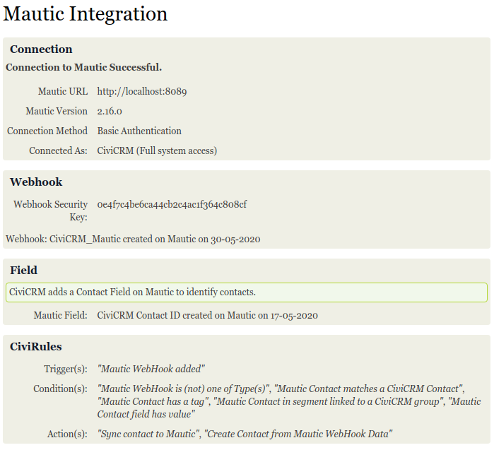

uk.co.vedaconsulting.mautic
==============================

## Introduction

This extension integrates CiviCRM with [Mautic](https://www.mautic.org), the Open-Source Marketing Automation software.
It currently provides:
 
 - Push sync contacts from CiviCRM to Mautic. This will synchronize contacts in a
   group to a Mautic segment.
 - A CiviRules Trigger to handle Mautic webhooks.
 - CiviRules Conditions:
   - Mautic Webhook type
   - Mautic Contact matches a CiviCRM Contact
   - Mautic Contact has a tag
   - Mautic Contact is in a segment linked to a CiviCRM group
   - Mautic Contact field has a particular value
 - CiviRules Actions:
   - Sync contact to Mautic
   - Create Contact from Mautic webhook data

## Installing the extension

1. Download extension from https://github.com/veda-consulting/uk.co.vedaconsulting.mautic/releases/latest.
2. Unzip / untar the package and place it in your configured extensions directory.
3. When you reload the Manage Extensions page the “Mautic Integration” extension should be listed with an Install link.
4. Proceed with install.

The remainder of this document assumes you have administrator access to a running Mautic installation.
You may also need filesystem access to the Mautic installation to clear the Mautic cache.

For development/testing, a [Docker image](https://hub.docker.com/r/mautic/mautic/) is available with a sample Docker compose file. 

## Connecting to Mautic

### Create a dedicated user on Mautic
On the Mautic installation, create a user with full API, Webhook and Contact permissions.
This will be a dedicated user for the extension.

### Enable Mautic's API
On the Mautic installation, navigate to *Settings -> Configuration -> API Settings*. Toggle 'API enabled' and 'Enable HTTP auth' to 'Yes'.

After these changes, clear the Mautic cache. The easiest way to do this is to go to the  app/cache directory from Mautic filesystem root and delete its content.

### Create Segments
On Mautic, [create one or more segments](https://docs.mautic.org/en/contacts/manage-segments).

 

### Extension Settings
On the CiviCRM installation, go to *Administer -> Mautic -> Mautic Settings*.

Mautic Base URL: https://my.mautic.installation
Authentication method: Basic Authentication
Enter the User Name and Password for the  dedicated user created previously.
*Note, the OAuth1 workflow is also supported but there are currently issues for certain operations*.

After you save the settings, the connection status page will confirm successful connection.

### Set CiviCRM Groups

